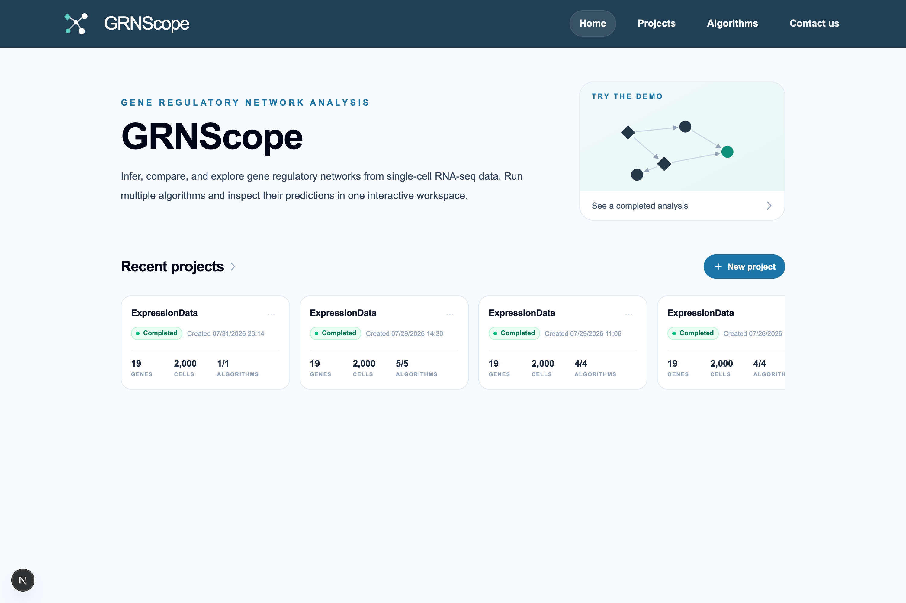
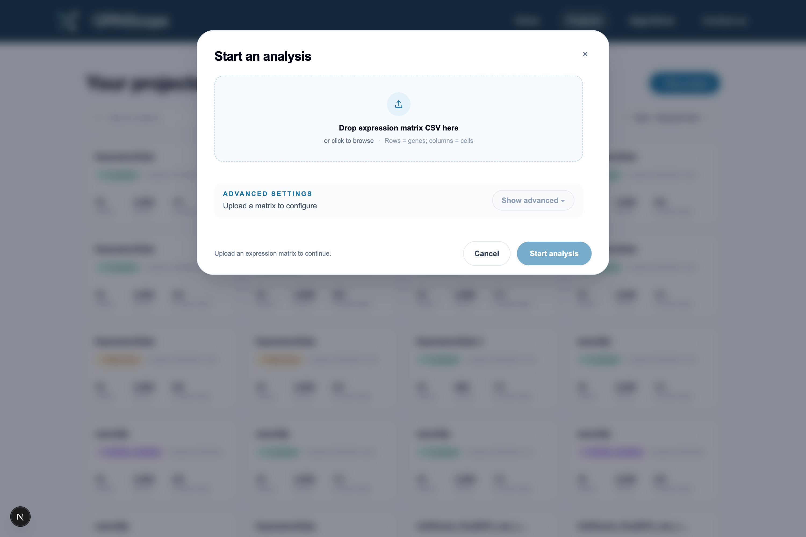
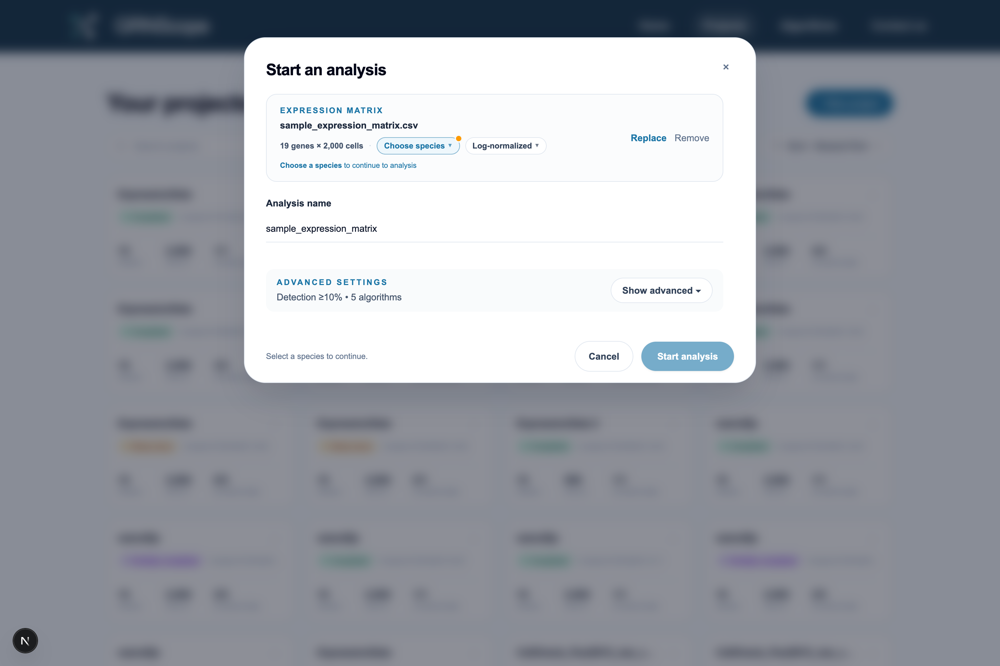
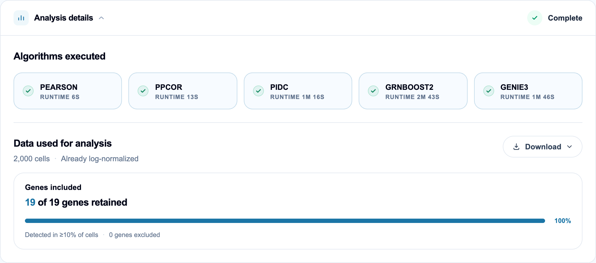
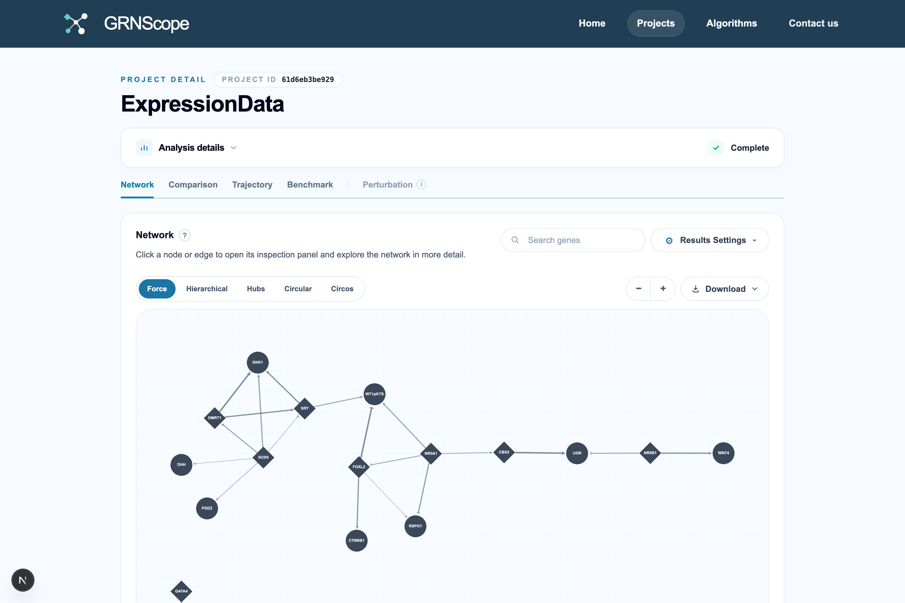
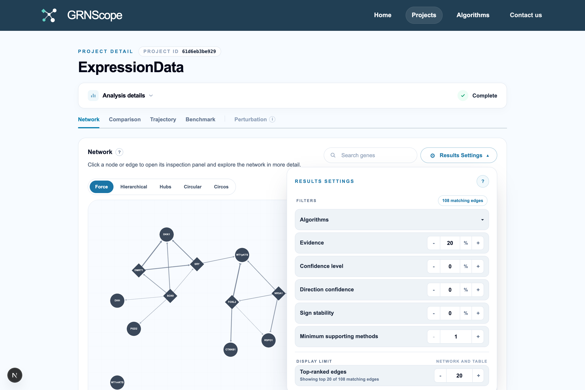

[← Overview](01-overview.md) · [Documentation index](README.md) · Next: [Input data formats →](03-input-data.md)

# 2. Quickstart

This walks you from an empty browser to a finished network. Allow about 15
minutes of reading and clicking, plus however long your algorithms take to run.

## 2.1 Open GRNScope



The home page has three entry points:

- **Projects** — your analyses. Everything you create lives here.
- **Algorithms** — a browsable catalog of every inference method, with its
  publication, its strengths, and its tunable parameters.
- **Try the demo** — a finished analysis you can click through without
  uploading anything.

## 2.2 Prepare a matrix (or use the sample)

You need one file: a CSV **expression matrix** with **genes as rows and cells as
columns**.

```
        ,E37_5_927 ,E42_7_69  ,E20_7_209 , ...
DMRT1   ,0.0023    ,0.0228    ,1.7351    , ...
FGF9    ,0.0188    ,0.0372    ,1.9803    , ...
RSPO1   ,2.2042    ,1.6942    ,0.0148    , ...
```

The top-left cell is usually blank. The first row holds cell identifiers, the
first column holds gene names, and everything else is a number.

A ready-made example ships with the app at
[`frontend/public/samples/sample_expression_matrix.csv`](../frontend/public/samples/sample_expression_matrix.csv)
(19 genes × 2,000 cells), together with a matching pseudotime file. It is small
enough to finish in a couple of minutes, which makes it ideal for a first run.

Full rules and the other four optional file types are in
[input data formats](03-input-data.md).

## 2.3 Start an analysis

Go to **Projects** and click **+ New project**.



Drop your expression matrix onto the panel, or click to browse. GRNScope
uploads it to a temporary area and inspects it immediately.



Three things happen automatically:

1. **Dimensions are read** — here, 19 genes × 2,000 cells. If this does not
   match what you expect, your rows and columns are probably transposed.
2. **The matrix state is detected** — this example was recognised as
   *Log-normalized*. GRNScope inspects value distributions to decide between
   raw counts, normalized, and log-normalized. It is a good guess, not a
   certainty; the dropdown lets you correct it, and doing so matters because it
   determines what preprocessing gets applied. See
   [matrix state detection](04-preprocessing.md#42-matrix-state-what-kind-of-numbers-are-these).
3. **The species is guessed** from your gene names — but you must confirm it.
   The **Choose species** control is highlighted and the dialog will not let you
   start until you set it. Species drives the transcription-factor reference
   list and, for CellOracle, the base regulatory network.

**Analysis name** defaults to the filename. Change it to something you will
recognise in a month.

## 2.4 Optional: open Advanced settings

The defaults are sensible and you can skip this section entirely on a first run.
Click **Show advanced** to see four groups.


**Gene selection** controls how many genes reach the algorithms. Three stages
run in a fixed order — detection, then trajectory, then variance — and each can
be switched on or off independently. By default only **Detection filtering** is
on, removing genes seen in fewer than 10% of cells.

> **This is the most important setting for runtime.** Several algorithms scale
> quadratically or cubically with gene count. If you upload 20,000 genes and
> leave every filter off, some methods will run for days. See
> [preprocessing](04-preprocessing.md).

**Optional biological inputs** is where you attach a pseudotime CSV (or ask
GRNScope to estimate one with Slingshot), a ground-truth network for
benchmarking, cluster labels, and CellOracle's species/base-GRN configuration.

**Algorithms** lists every method that is compatible with what you uploaded, and
**every compatible method is selected for you by default**. A method is
compatible when its requirements are met: pseudotime-based methods stay
unavailable until you supply pseudotime, CellOracle until you configure its
species and base GRN, SCSGL until you supply a ground-truth network. With a bare
expression matrix that comes to five: PIDC, GENIE3, GRNBoost2, PPCOR, and
PEARSON — which is why the summary line above reads `5 algorithms`.

Three of them carry a **Recommended** badge — PIDC, GENIE3, and GRNBoost2 —
because the BEELINE benchmark found them among the strongest performers and none
needs pseudotime. The badge is advice, not the default selection.

Deselect anything you do not want; each algorithm can also be expanded to tune
its parameters. Adding pseudotime later re-runs the auto-selection and picks up
the newly compatible methods.

**Result settings** contains **Maximum edges per target** (default 20): for each
target gene, only its strongest N candidate regulators are kept. This bounds
result size; raise it if you want a denser network.

## 2.5 Start and wait

Click **Start analysis**. You are taken to the project page.

Progress is shown per algorithm. Work is scheduled fastest-method-first so
useful results appear early rather than all at the end. You can stop an
individual algorithm or the whole project at any time, and rerun a single
algorithm afterwards without redoing the others.

Because each method runs once on the full data and then on several bootstrap
resamples, a single algorithm reports several sub-runs. That is expected — it is
where the confidence numbers come from.

If you set a **notification email**, you will be told when the job finishes and
can close the tab.

## 2.6 Read the results

When the run completes, the project page shows five tabs.



Start with **Analysis details** at the top. It records which algorithms ran and
how long each took, and — critically — **which data they actually saw**: the
number of cells, the matrix state used, and how many genes survived filtering.
In the example above all 19 genes were retained because none fell below the 10%
detection threshold.



**Network** is the default view. Diamonds are transcription factors, circles are
other genes, and edge thickness reflects evidence. Click any node or edge to
open an inspection panel. Five layouts are available (Force, Hierarchical, Hubs,
Circular, Circos), and the whole figure can be exported.

The other tabs are **Comparison** (how the methods agree with each other and the
consensus edge table), **Trajectory** (only with pseudotime), **Benchmark**
(only with a reference network), and **Perturbation** (only after CellOracle
runs). All of them are described in
[reading your results](07-results-guide.md).

## 2.7 Filter down to the edges you trust

Click **Results Settings** in the Network view.



This panel is the heart of the interface. Every filter applies to the network
graph and the tables at the same time:

| Filter | What it does |
| --- | --- |
| **Algorithms** | Include or exclude individual methods from the consensus |
| **Evidence** | Minimum consensus evidence (how strongly methods rank the edge) |
| **Confidence level** | Minimum bootstrap confidence (how reproducible it is) |
| **Direction confidence** | Minimum agreement on which gene is upstream |
| **Sign stability** | Minimum agreement on activation vs repression |
| **Minimum supporting methods** | Require the edge in at least N methods |
| **Top-ranked edges** | Cap how many edges are drawn |

A reasonable first pass for a real dataset: set **Minimum supporting methods**
to at least 2 and **Confidence level** to 70%, then look at what survives. Each
number is defined precisely in [the metrics reference](06-metrics.md).

## 2.8 Export

Every panel has a **Download** button. Networks export as PNG or SVG; tables
export as CSV; the whole project exports as a metadata bundle recording the
exact settings used. Since projects are tied to your browser cookie and not to
an account, **download anything you need to keep**. See
[downloads](07-results-guide.md#79-downloads).

## 2.9 A sensible first experiment

If you are evaluating GRNScope rather than answering a specific question:

1. Run the three recommended algorithms on a **small** gene set (500 or fewer).
2. Supply a ground-truth network if you have one, even a partial one — the
   Benchmark tab immediately tells you whether the methods are doing better than
   chance on your data.
3. Look at **Repeat-run stability** in the Comparison tab before trusting any
   individual edge. If a method's bootstrap runs disagree with each other, its
   edges are not reproducible on your data no matter how good they look.

---

Next: [3. Input data formats →](03-input-data.md)
