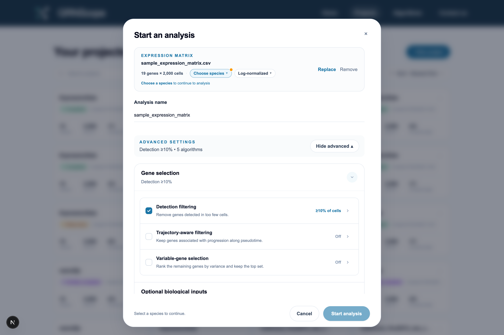

[← Input data](03-input-data.md) · [Documentation index](README.md) · Next: [Algorithm catalog →](05-algorithms.md)

# 4. Preprocessing and gene selection

Between your upload and the algorithms sits a preprocessing pipeline. It does
two jobs: put the numbers into the state the algorithms expect, and reduce the
gene set to something that will finish running.

Everything here is recorded in the project's **Analysis details** panel, so you
can always see what the algorithms actually received.

## 4.1 The pipeline

```
uploaded matrix
      │
      ▼
① matrix transformation      raw → normalized → log-normalized (as needed)
      │
      ▼
② detection filtering        drop genes seen in too few cells
      │
      ▼
③ trajectory-aware filtering keep genes that change along pseudotime
      │
      ▼
④ variable-gene selection    keep the N highest-variance genes
      │
      ▼
⑤ per-algorithm gene cap     each method may reduce further
      │
      ▼
   algorithms
```

Stages ② ③ ④ are the "gene selection" stages and each is independently
switchable. **The order is fixed** and does not follow the order you tick the
boxes — it is always detection, then trajectory, then variance
(`PREPROCESSING_STAGE_ORDER`,
[`app/preprocessing_contract.py`](../backend/app/preprocessing_contract.py)).
By default only detection is on.

The result is cached and shared: all algorithms in a project read the same
preprocessed matrix, so they are compared on identical input. The cache key
includes every setting and the input files' size and modification time, so
changing any setting invalidates it correctly.

## 4.2 Matrix state: what kind of numbers are these?

scRNA-seq data reaches you in one of three states, and algorithms behave very
differently depending on which:

| State | What it looks like | Typical source |
| --- | --- | --- |
| **raw** | Non-negative integers; per-cell totals vary a lot | Cell Ranger counts |
| **normalized** | Non-integers; per-cell totals nearly identical | After library-size scaling |
| **log_normalized** | Non-integers, compressed range (often ≤ ~10) | After `log1p` of normalized |

### How GRNScope guesses

[`matrix_state_detection.py`](../backend/app/matrix_state_detection.py) samples
up to 96 evenly spaced cell columns and computes four things: the fraction of
values that are integers, whether any value is negative, the maximum value, and
the **coefficient of variation of per-cell totals** (standard deviation ÷ mean).
It also tries undoing a log transform in base *e*, 2, and 10 and recomputes the
CV each time.

The logic, in order:

1. **Any negative values** → refuse to classify. Negatives mean scaled or
   centred data, which none of the three states allows. You must choose the
   state yourself.
2. **≥99.9% integers** → `raw` (high confidence) — unless per-cell totals are
   already near-constant (CV ≤ 0.03), in which case it is more likely rounded
   normalized data (`normalized`, medium confidence).
3. **Undoing a log makes totals near-constant** and does so clearly better than
   the untransformed values → `log_normalized` (high confidence). This is the
   strongest available evidence: real log-normalized data reverts to constant
   library sizes when you exponentiate it.
4. **Totals already near-constant** → `normalized` (high confidence).
5. **Maximum value ≤ 30** → `log_normalized` (medium confidence) — a compressed
   range is suggestive but not proof.
6. Otherwise → `normalized` (medium confidence).

The dialog shows the verdict, a confidence level, and the reasoning. **Override
it when you know better.** Manually chosen states are recorded as
`user_override` rather than `automatic` in the project manifest.

### What the transformation does

[`matrix_transformation_service.py`](../backend/app/services/matrix_transformation_service.py)
uses scanpy to bring everything to the same place:

| Declared state | Operations applied |
| --- | --- |
| `raw` | Library-size normalize to a total of 10,000 per cell, then `log1p` |
| `normalized` | `log1p` only |
| `log_normalized` | Nothing |

This is why declaring the state correctly matters: telling GRNScope that
already-logged data is raw applies a log twice and flattens your signal;
telling it that raw counts are log-normalized skips normalization entirely and
lets sequencing depth dominate.

**CellOracle is the exception.** It performs its own preprocessing internally
and needs a specific input state, so GRNScope maintains a separate CellOracle
expression file rather than feeding it the shared preprocessed matrix
(`ensure_celloracle_expression_source`).

## 4.3 Gene selection in the interface



Each stage shows its current setting on the right and expands for details.

## 4.4 Stage 1 — Detection filtering

**On by default, threshold 10%.**

> Remove genes detected in too few cells.

A gene is "detected" in a cell when its value is **greater than zero**. The
stage keeps genes detected in at least

```
minimum_cells = ceil(cell_count × threshold_percent / 100)
```

cells, with a floor of 1
([`gene_selection_service.py`](../backend/app/services/gene_selection_service.py)).

With 2,000 cells and the 10% default, a gene must be non-zero in at least 200
cells to survive.

**Why this exists.** Single-cell data is mostly zeros. A gene detected in 15 of
2,000 cells carries almost no usable covariance signal but still costs the same
compute as any other gene, and it inflates the number of statistical tests. This
is the cheapest, safest filter available and it is on by default for that
reason.

The threshold must be greater than 0 and at most 100. If it removes every gene,
the run stops with an error telling you to lower it.

## 4.5 Stage 2 — Trajectory-aware filtering

**Off by default. Requires pseudotime.**

> Keep genes associated with progression along pseudotime.

This keeps only genes whose expression changes significantly along your
trajectory — the genes plausibly involved in the process you are studying,
rather than housekeeping genes that are simply always on.

You choose the source of the p-values:

**Calculate** (default). GRNScope computes them itself in
[`gene_ordering_service.py`](../backend/app/services/gene_ordering_service.py):

- For each lineage, it fits a **polynomial regression of expression on
  pseudotime**, degree up to 3, on the cells that have a value for that lineage.
- It tests the fit against an intercept-only null with an **F-test**, giving one
  p-value per gene per lineage.
- Since a gene may be associated with any lineage, it takes the **smallest
  p-value across lineages and multiplies by the number of lineages** — a
  Bonferroni correction for having looked at several branches.
- Output is a `GeneOrdering.csv` with columns `VGAMpValue` and `Variance`,
  sorted by p-value ascending. The name mirrors BEELINE's convention.

**Upload.** You supply your own GeneOrdering CSV — for example from a proper
VGAM/tradeSeq analysis. Format in
[input data](03-input-data.md#36-geneordering-csv-optional).

### Threshold and correction

Genes are kept when `p ≤ threshold` (default 0.01). If **Bonferroni correction**
is enabled, the effective threshold becomes

```
effective_threshold = threshold / number_of_genes_in_the_ordering_file
```

which is much stricter. With 20,000 genes and a 0.01 threshold, the effective
cutoff is 5 × 10⁻⁷.

Genes in the ordering file that are missing from the expression matrix are
dropped silently; only the intersection is kept. If nothing survives, the run
stops and suggests raising the threshold or disabling Bonferroni.

## 4.6 Stage 3 — Variable-gene selection

**Off by default, 500 genes.**

> Rank the remaining genes by variance and keep the top set.

Variance is computed per gene across all cells (population variance, `np.var`),
genes are ranked descending, and the top N are kept. This is the classic
highly-variable-gene step: a gene with the same value in every cell cannot
explain differences between cells.

### The known-TF option

Ticking **include known TFs** changes the selection policy. The important part
is what it does *not* do:

> **The gene count stays a hard cap.** Known transcription factors are
> prioritised *within* that budget, not appended on top of it.

Concretely, with a 500-gene budget:

1. Take all known TFs present in your data, in variance order, up to 500.
2. Fill the remaining slots with the highest-variance non-TF genes.

So if 120 TFs are present, you get those 120 plus the top 380 non-TFs. If 800
TFs are present, you get the 500 highest-variance TFs and no other genes — the
summary then reports `known_tfs_excluded_by_total_limit`.

**Why this option exists.** Real regulators are frequently *not* highly
variable — a transcription factor can control a large program while itself
changing modestly. A pure variance filter systematically discards exactly the
genes you are trying to find regulators among. The TF list comes from curated
per-species references
([`tf_reference_service.py`](../backend/app/services/tf_reference_service.py)),
which is why confirming your species matters.

A related switch, **retain significant TFs**, links stages 2 and 3: TFs that
passed the trajectory test are protected during variance selection. It only
takes effect when both trajectory and variance stages are enabled.

## 4.7 Stage 4 — Per-algorithm gene caps

After the shared pipeline, individual algorithms apply their own limit. This is
not redundant — it exists because the methods have wildly different scaling
behaviour, and one slow method should not force you to shrink the gene set for
everything.

| Algorithm | Default cap | Reason |
| --- | --- | --- |
| SCRIBE | 300 | Evaluates every directed gene pair |
| PIDC | 500 | Evaluates every gene *triplet* |
| PPCOR | 500 | Inverts a dense correlation matrix; valid p-values need fewer genes than cells |
| SINCERITIES | 500 | Partial-correlation step needs more cells than genes |
| SINGE | 500 | Fits lagged regulator–target models |
| GRISLI | 500 | Memory-bound |
| GRNVBEM | 500 | Dense variational Bayesian computation per target |

When more genes remain than the cap, each method keeps the **highest-variance**
ones. GRNScope may also lower a cap automatically below what you set — PPCOR and
SINCERITIES both need genes < cells to produce valid statistics, and bootstrap
resampling reduces the effective cell count. This is expected and is reported in
the gene-selection audit.

You can see exactly which genes each algorithm used via the gene-selection audit
endpoint (`/api/projects/{id}/gene-selection-audit`) and in the per-algorithm
result files.

## 4.8 Practical guidance

**Starting from raw counts of 20,000 genes.** Turn on detection filtering (10%)
and variable-gene selection (1,000–2,000, with known TFs included). This is the
standard configuration and gets most datasets to a workable size.

**You have good pseudotime and a specific process in mind.** Add trajectory-aware
filtering. It is more biologically targeted than variance alone, since it selects
for "changes during the process" rather than "varies a lot for any reason".

**Small curated gene set (under a few hundred).** Turn everything off. The
example project in this documentation has 19 genes and retains all 19.

**Your run is too slow.** Reduce the gene count first — it is superlinear for
most methods and by far the largest lever. Only then drop slow algorithms. See
[the runtime table](05-algorithms.md#53-runtime-and-scheduling).

**Something looks wrong in the results.** Open Analysis details and check the
matrix state and retained gene count before suspecting the algorithms. A wrong
matrix state is the single most common cause of results that look like noise.

---

Next: [5. Algorithm catalog →](05-algorithms.md)
