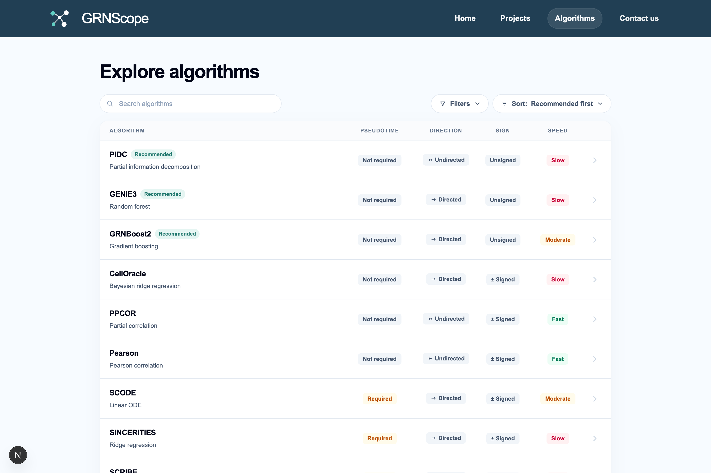
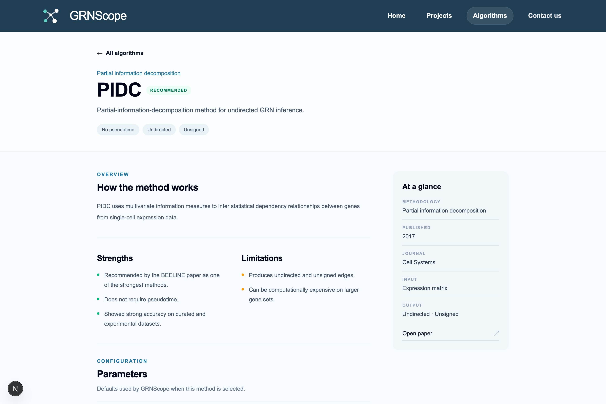

[← Preprocessing](04-preprocessing.md) · [Documentation index](README.md) · Next: [Metrics reference →](06-metrics.md)

# 5. Algorithm catalog

GRNScope ships 15 inference methods, 13 of them currently enabled. Browse them
in the app under **Algorithms**.



Each entry links to a detail page with the publication, strengths, limitations,
recommended uses, and every tunable parameter.



## 5.1 Choosing methods: the short version

**If you do not know where to start, run the three marked Recommended.** PIDC,
GENIE3, and GRNBoost2 carry that badge because the BEELINE benchmark found them
among the strongest performers, they use complementary mathematics (information
theory, random forests, gradient boosting), and none of them needs pseudotime.

Note that the new-project dialog does not preselect only those three — it
selects **every compatible method**, and you deselect what you do not want.

Then decide by what you have and what you need:

| Situation | Add |
| --- | --- |
| No pseudotime | PPCOR and PEARSON as fast baselines |
| Reliable pseudotime | SCODE, SINCERITIES, LEAP; then GRISLI/GRNVBEM if runtime allows |
| You need activation vs repression | CellOracle, PPCOR, SCODE, SINCERITIES, GRNVBEM — the signed methods |
| You want prior-informed regulation | CellOracle |
| You want to perturb genes *in silico* | CellOracle (it is the only path to the Perturbation view) |
| You want a sanity check on the pipeline | PEARSON — fast, local, no Docker |

Running more methods is generally better, because the consensus rewards
agreement across independent approaches. The constraint is runtime.

## 5.2 The full catalog

Legend: **Dir** = produces directed edges · **Sign** = distinguishes activation
from repression · **PT** = requires pseudotime.

| Algorithm | Approach | Dir | Sign | PT | Speed | Year |
| --- | --- | :-: | :-: | :-: | --- | --- |
| **PIDC** ★ | Partial information decomposition | – | – | – | Slow on large gene sets | 2017 |
| **GENIE3** ★ | Random forest | ✓ | – | – | Medium–slow | 2010 |
| **GRNBOOST2** ★ | Gradient boosting | ✓ | – | – | Medium | 2018 |
| **CELLORACLE** | Prior-informed Bayesian ridge | ✓ | ✓ | – | Slow on large data | 2022 |
| **PPCOR** | Partial correlation | – | ✓ | – | Fast | 2015 |
| **PEARSON** | Pearson correlation baseline | – | ✓ | – | Fast | — |
| **SCODE** | Linear ODE | ✓ | ✓ | ✓ | Fast–medium | 2017 |
| **SINCERITIES** | Ridge regression on time bins | ✓ | ✓ | ✓ | Slow on large gene sets | 2018 |
| **SCRIBE** | Restricted directed information | ✓ | – | ✓ | Slow | 2020 |
| **SINGE** | Kernel Granger causality ensemble | ✓ | – | ✓ | Very slow | 2022 |
| **LEAP** | Lagged correlation | ✓ | – | ✓ | Fast | 2017 |
| **GRISLI** | Linear ODE + velocity | ✓ | – | ✓ | Slow on large data | 2018 |
| **GRNVBEM** | Variational Bayesian ARMA | ✓ | ✓ | ✓ | Slow on large gene sets | 2018 |
| *JUMP3* † | Dynamical model + trees | ✓ | – | ✓ | Medium | 2015 |
| *SCSGL* † | Kernelized signed graph learning | – | ✓ | – | Medium | 2022 |

★ = flagged **Recommended** in the catalog  † = **currently inactive** and not selectable

The definitive list lives in
[`app/algorithm_registry.py`](../backend/app/algorithm_registry.py), which is
also what the website reads — the catalog page cannot drift from the code.

### What each method actually does

**PIDC** measures multivariate information between genes, decomposing it to
separate direct dependency from shared information. Because it evaluates gene
*triplets*, cost rises very steeply with gene count. It produces undirected,
unsigned edges — but was one of the top performers in BEELINE.

**GENIE3** treats inference as many regression problems: for each target gene,
train a random forest to predict it from all other genes, and use each
predictor's feature importance as the edge weight. Directed by construction,
unsigned (importance has no sign).

**GRNBOOST2** is the same idea with gradient-boosted trees instead of random
forests, via the Arboreto library. Usually faster and more scalable than GENIE3.

**CELLORACLE** is different in kind from the others. Rather than testing every
possible gene pair, it starts from a **base GRN** — a prior list of plausible
TF–target links derived from promoter/enhancer accessibility data — and uses
regularised regression to work out which of those priors are active in your
cells. This makes it far more constrained, gives it directed *and* signed
coefficients, and is what enables *in silico* perturbation. The cost is that it
needs a species-specific prior; a species mismatch fails the run outright.

**PPCOR** computes the correlation between two genes after removing the linear
influence of all other genes. Signed and fast, but undirected, and it inverts a
dense matrix — so it needs fewer genes than cells to produce valid p-values.

**PEARSON** is plain pairwise correlation. It is included as a BEELINE
*baseline*, not as a serious inference method: it is the yardstick a real method
should beat. Because it runs locally without Docker, it is also the fastest way
to confirm your pipeline works end to end.

**SCODE** models expression as a system of linear ODEs with a low-dimensional
latent space, fitted along pseudotime. Directed and signed.

**SINCERITIES** splits the trajectory into time bins, measures how each gene's
distribution changes between consecutive bins, and uses ridge regression plus
partial correlation to assign directed, signed influence.

**SCRIBE** uses restricted directed information — an information-theoretic
measure of how much knowing gene A's past reduces uncertainty about gene B's
present, conditioned on B's own past. This makes it a genuinely causal-flavoured
measure, at high computational cost.

**SINGE** applies kernel-based Granger causality across an ensemble of
resampled, smoothed versions of your data. Thorough and by far the slowest
method here.

**LEAP** sorts cells by pseudotime and looks for lagged correlation: A's rise
consistently preceding B's. Cheap, and direction comes from the lag.

**GRISLI** fits a linear ODE using estimated RNA velocity, with stability
selection over many resampling rounds.

**GRNVBEM** fits a first-order autoregressive moving-average model in a
variational Bayesian framework, giving directed, signed edges with dense
computation per target gene.

## 5.3 Runtime and scheduling

GRNScope runs algorithms **fastest first** so useful results appear early
(`ALGORITHM_RUN_DIFFICULTY_ORDER`). The order, based on production timings:

```
PEARSON → PPCOR → SINCERITIES → CELLORACLE → PIDC → LEAP → GRNBOOST2 →
SCRIBE → GRISLI → GENIE3 → JUMP3 → SCSGL → SINGE → SCODE → GRNVBEM
```

Two multipliers on top of the per-method cost:

- **Gene count.** Superlinear for nearly everything, cubic for PIDC. Halving
  your gene set does far more than dropping a method.
- **Bootstrap runs.** Each algorithm runs **4 to 16 times** in total (one
  full-data fit plus 3–15 bootstraps). Early stopping usually keeps this at the
  low end — see [the metrics reference](06-metrics.md#65-early-stopping).

For scale, the 19-gene × 2,000-cell example project used in these docs:

| Algorithm | Total runtime |
| --- | --- |
| PEARSON | 6 s |
| PPCOR | 13 s |
| PIDC | 1 m 16 s |
| GENIE3 | 1 m 46 s |
| GRNBOOST2 | 2 m 43 s |

Multiply generously for realistic gene counts.

Parallelism is controlled by `GRNSCOPE_MAX_CONCURRENT_ALGORITHMS` (in-process)
or `GRNSCOPE_WORKER_COUNT` (Redis/RQ), with CPU and memory budgets divided among
concurrent tasks. See [operations](09-operations.md).

## 5.4 Parameters

Every algorithm's parameters are declared in the registry with a type, a
default, and bounds, and they are validated **server-side** — an out-of-range
value is rejected rather than silently clamped. Parameters marked *advanced* are
collapsed by default in the settings dialog.

Parameters worth knowing about:

**`maxGenes`** (PIDC, PPCOR, SINCERITIES, SCRIBE, SINGE, GRISLI, GRNVBEM) — the
per-method gene cap discussed in
[preprocessing](04-preprocessing.md#47-stage-4--per-algorithm-gene-caps).
The single most effective runtime control.

**GENIE3 — `nEstimators`** (default 400, 1–2000) trees, and **`maxFeatures`**
(`sqrt`, `log2`, `all`) candidate regulators per split. More trees give more
stable rankings at roughly linear cost.

**GRNBOOST2 — `learningRate`** (default 0.01), **`nEstimators`** (default 5000,
an upper bound; early stopping normally halts well before it), **`maxFeatures`**
(default 0.1, the fraction of regulators sampled per round).

**CellOracle — `maxCells`** (default 30,000) per network scope, and
**`pValueCutoff`** (default 0.05) for discarding weak links. Species and base
GRN are set in CellOracle's own configuration dialog, not here. Base-GRN options
are `auto`, `mouse_scATAC_atlas`, and `promoter`.

**PPCOR — `pVal`** (default 0.01).

**SCODE — `z`** (latent dimension, default 4 — the paper's canonical value),
**`nIter`** (default 1000), **`nRep`** (default 3 runs averaged).

**SINCERITIES — `nBins`** (default 10 time windows).

**SCRIBE — `method`** selects the restricted-directed-information variant
(`RDI`, `uRDI`, `cRDI`, `ucRDI`; default `ucRDI`), **`delay`** (default 5) is the
lag between regulator and target, **`ignorePT`** defaults to true.

**SINGE — `lambda`** (regularisation; higher gives sparser networks),
**`num_replicates`** (default 3), and the constrained pair **`dT`** × **`num_lags`**
whose product must be **less than 100**. This is enforced when the job is
created, so an invalid combination is rejected up front rather than failing
mid-run.

**LEAP — `maxLag`** (default 0.33, as a fraction).

**GRISLI — `L`** (default 10), **`R`** (stability-selection rounds, default
1000), **`alphaMin`**.

Unless you have a specific reason, leave these alone. The defaults are the
published values or BEELINE's, and tuning them changes results in ways the
confidence metrics cannot detect for you.

## 5.5 Inactive algorithms

Two methods are present in the registry but disabled:

**JUMP3** — combines a dynamical model of transcription with tree-based
reconstruction. Not among the 12 methods evaluated in the original BEELINE
paper, and its Docker image is listed as local-style in the BEELINE repository.

**SCSGL** — kernelized signed graph learning. Requires a `GroundTruthNetwork.csv`
to run at all, plus three mandatory parameters (positive edge density, negative
edge density, association measure) with no safe defaults.

They are visible in the registry for completeness and can be enabled by setting
`"active": True`, but they are not exposed in the interface.

## 5.6 What the edge weights mean (and do not mean)

Each algorithm emits a **ranked edge list**: source, target, and a score.
Critically, **those scores are not comparable across methods**. GENIE3 emits
random-forest importances, PPCOR emits correlation coefficients in [−1, 1],
PIDC emits information-theoretic quantities. They have different units,
different ranges, and different distributions.

This is exactly why GRNScope converts every score into a **per-target
percentile** before combining anything. That conversion, and everything built on
top of it, is the subject of the next chapter.

---

Next: [6. Metrics reference →](06-metrics.md)
