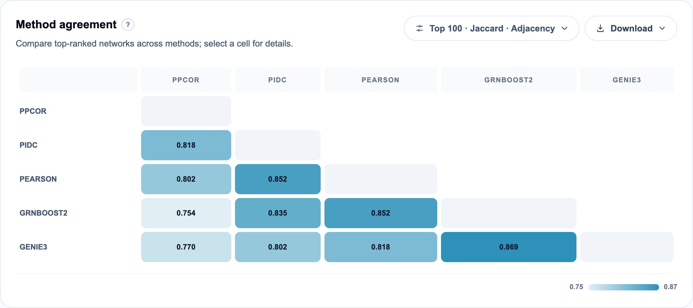
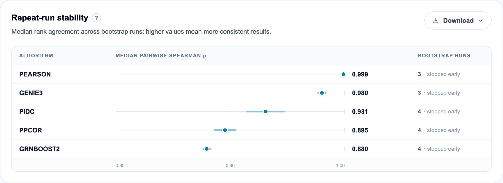
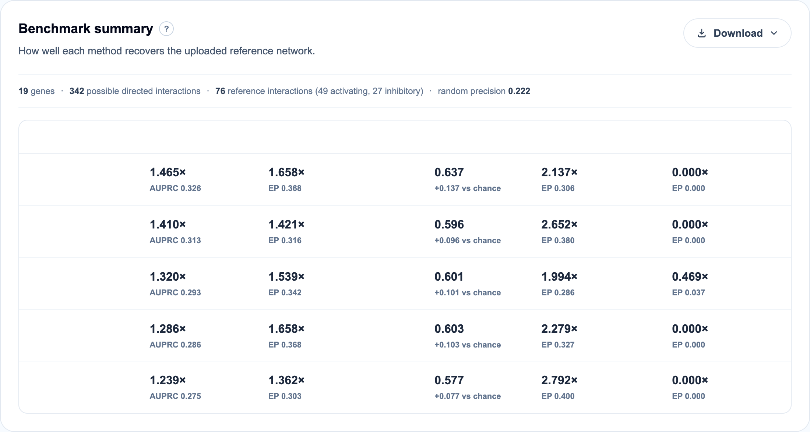
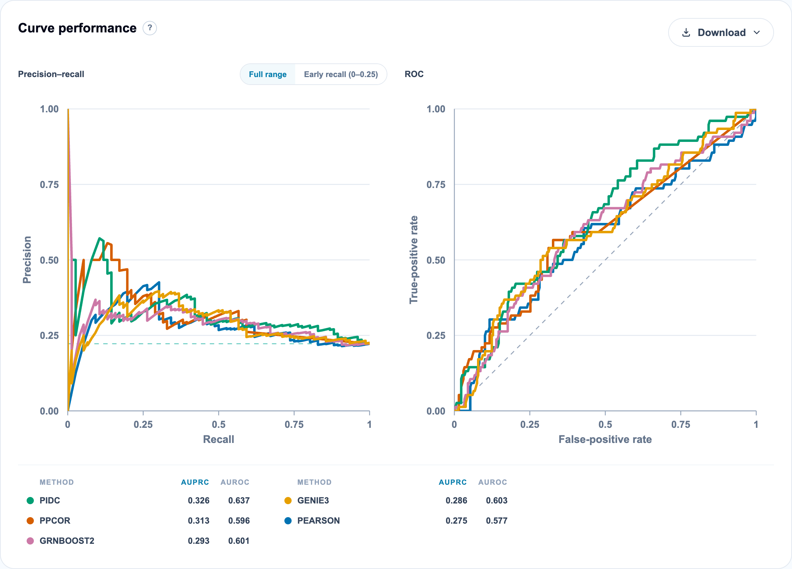
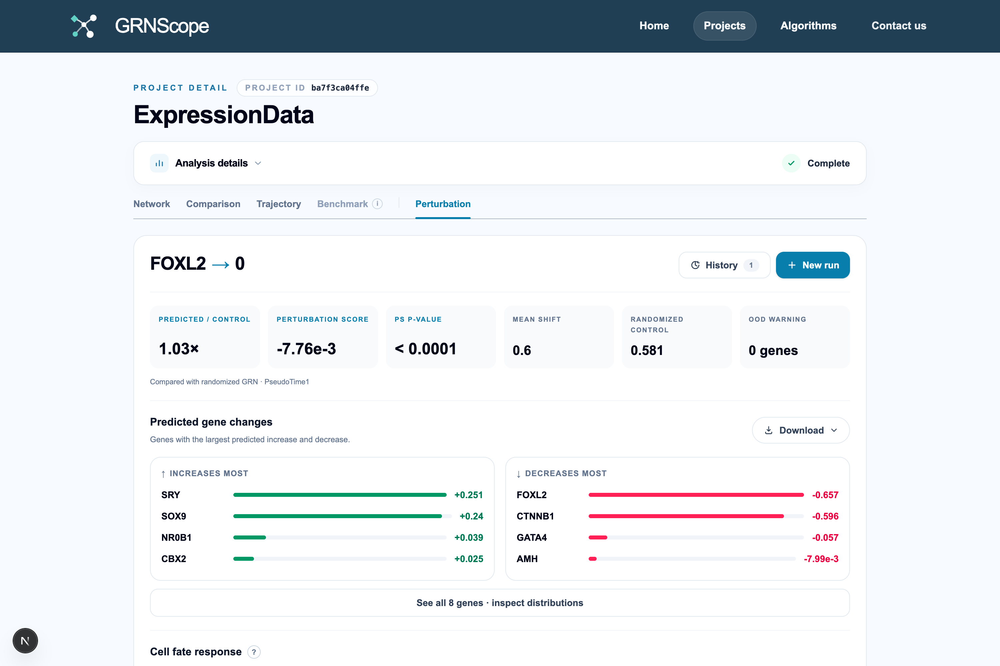

[← Algorithms](05-algorithms.md) · [Documentation index](README.md) · Next: [Reading your results →](07-results-guide.md)

# 6. Metrics reference

This is the chapter that explains every number GRNScope shows you. Each metric
gets a plain-language meaning, the exact formula, and a pointer to the code.

**The in-app version.** Click the **?** beside any panel for a shorter version
of the same material, including a full formula walkthrough.


## 6.1 Notation

| Symbol | Meaning |
| --- | --- |
| *e* | one edge, source → target |
| *m* | one method (algorithm) |
| *b* | one bootstrap run |
| *t* | one target gene |
| *r<sub>m</sub>(e)* | the edge's rank among candidate regulators of its target |
| *R<sub>t</sub>* | number of ranked candidate regulators for target *t* |
| *B<sub>m</sub>* | number of completed bootstrap runs for method *m* |
| *K* | the top-*K* threshold, **10** by default |
| *M* | number of selected methods |

## 6.2 The bootstrap idea

An algorithm run once gives you a ranked edge list and no sense of whether that
list would survive if you had sampled slightly different cells. Bootstrapping
answers exactly that question.

GRNScope draws a **bootstrap resample**: from your *N* cells it draws *N* cells
at random **with replacement**. Some cells appear twice or three times, roughly
37% of cells do not appear at all, and the resample is the same size as the
original. It reruns the algorithm on that resample and records the new ranking.
Repeat several times, and an edge that shows up near the top every time is
reproducible; one that appears once and disappears was driven by a handful of
cells.

Three implementation details that matter:

- **Sample size is the full *N***, drawn with replacement — a genuine bootstrap,
  not a subsample. (`CONFIDENCE_RESAMPLING_SCHEME = "cell_bootstrap_with_replacement_v1"`)
- **The draws are deterministic and shared across methods.** The random seed is
  derived from the dataset and is deliberately *independent of the algorithm*
  (`bootstrap_column_draws`), so every method in your project sees the identical
  set of resampled cells. Differences between methods are therefore real
  differences between methods, not different random draws.
- **The full-data fit is separate.** In addition to the bootstraps, each method
  is fitted once on your complete, unresampled data (run id `full-data`). That
  fit provides the displayed evidence and the reference sign; the bootstraps
  provide the confidence. They are never mixed up.

**Run count: 3 to 15**, chosen automatically, with early stopping (§6.5). Older
projects may carry a stored higher number; it is treated as a ceiling and
clamped into that range (`resolve_confidence_settings`).

Why so few? Each bootstrap run is a complete rerun of the algorithm. At 100
replicates, a method taking two minutes takes three and a half hours. The
early-stopping check exists so that runs stop as soon as the ranking has settled,
which for well-behaved methods happens after three or four.

> **A caveat worth stating.** With 3–15 replicates, confidence is a coarse
> measure. It distinguishes "always recovered" from "sometimes" from "never"
> reliably; it does not support fine distinctions like 0.80 versus 0.87.

## 6.3 Evidence — how strongly one method ranks an edge

Different algorithms emit scores on incompatible scales
([§5.6](05-algorithms.md#56-what-the-edge-weights-mean-and-do-not-mean)), so
raw scores cannot be averaged. GRNScope converts each score into a **per-target
percentile** instead.

**Procedure**, for one method and one run:

1. Group predicted edges **by target gene**.
2. Within a target, keep the strongest entry per source (drop duplicates).
3. Sort candidate regulators by **descending |score|** — the absolute value, so
   that a strong repression ranks alongside a strong activation.
4. Assign ranks, with **exact ties receiving their average rank** (positions 2
   and 3 both become 2.5).
5. Convert rank to a 0–1 score:

$$
E_m(e) = \begin{cases}
1 - \dfrac{r_m(e) - 1}{R_t - 1} & \text{if } R_t > 1 \\[2ex]
1 & \text{if } R_t \le 1
\end{cases}
$$

The best regulator of a target gets **1.0**, the worst gets **0.0**, and
everything in between is linearly spaced.

**Why per-target and not global?** Because the question "is A a plausible
regulator of B?" is naturally about B's regulators. A globally weak score might
still be the best available explanation for a quietly expressed target. Ranking
within each target also removes the influence of a method's overall score scale.

**Which evidence is displayed.** When an edge appears in the full-data fit, the
displayed evidence is the **full-data** percentile. When it appears only in
bootstraps, the bootstrap mean is shown instead and the edge is flagged as
absent from the full-data fit
(`merge_full_data_with_bootstrap_edges`).

## 6.4 Stability and Confidence — how reproducible it is

An edge is **selected** in a bootstrap run when it ranks in the **top *K***
regulators of its target (*K* = 10 by default,
`DEFAULT_CONFIDENCE_STABILITY_TOP_K`):

$$
I_{m,b}(e) = \begin{cases} 1 & \text{if } r_{m,b}(e) \le K \\ 0 & \text{otherwise} \end{cases}
$$

**Stability** is the fraction of runs in which that happened:

$$
\text{Stability}_m(e) = \frac{1}{B_m}\sum_{b=1}^{B_m} I_{m,b}(e) = \frac{N_{\text{selected}}}{B_m}
$$

**Confidence** is stability clamped to [0, 1]:

$$
C_m(e) = \mathrm{clamp}\big(\text{Stability}_m(e),\ 0,\ 1\big)
$$

They are the same number. Two names survive because Confidence is the
user-facing filter while Stability is the underlying statistic
(`finalize_confidence_accumulator`,
[`beeline_service.py:3381`](../backend/app/services/beeline_service.py)).

**Read it as:** *"in what fraction of resampled datasets did this method still
call this one of the target's top 10 regulators?"* 100% means every run; 40%
means fewer than half.

**Evidence and Confidence are independent and you need both.** An edge can have
high evidence and low confidence (ranked first once, then vanished — a fluke) or
moderate evidence and high confidence (consistently rank 6 or 7 — dependable but
not dominant). The second is usually the better hypothesis.

**A missing edge contributes 0, not "no data".** Evidence is divided by the
**total** run count, not by the number of runs where the edge appeared. An edge
seen in 2 of 10 runs with percentile 0.9 each time gets evidence 0.18, not 0.9.
This is deliberate — absence is evidence of weakness.

## 6.5 Early stopping

After the minimum of **3** runs, GRNScope compares the current aggregated edge
ranking against the previous one using the **Spearman rank correlation of
per-edge confidence values**. When ρ ≥ **0.95** on **2 consecutive** checks, the
ranking is judged settled and no further bootstraps are run
(`spearman_stability_check`, `DEFAULT_CONFIDENCE_STOP_RHO`,
`DEFAULT_CONFIDENCE_STOP_STREAK`).

Identical vectors count as perfectly stable. If a vector has no rank variation
at all, ρ is undefined and no stop is triggered.

This is why the Comparison view often shows "3 · stopped early" — it means the
method's ranking stopped changing, which is a good sign, not a truncated run.

## 6.6 The evidence interval

Each edge carries a **95% interval on its evidence**: the 2.5th and 97.5th
percentiles of the per-run evidence values across bootstraps, computed by linear
interpolation (`linear_quantile`). Runs in which the edge was absent contribute
evidence 0 and are included in the percentile calculation.

A narrow interval means the edge sits at a consistent rank; a wide one means its
rank swings with the cells sampled. Note this describes **evidence variability**
and is a separate statistic from Confidence, which describes top-*K* recovery
frequency.

## 6.7 Sign — activation or repression, for one method

Only [signed methods](05-algorithms.md#52-the-full-catalog) contribute here.
Others abstain entirely.

Within the runs where the edge was selected, GRNScope counts how many had a
positive raw score (*N⁺*) and how many negative (*N⁻*), and defines
*N<sub>signed</sub>* = *N⁺* + *N⁻*.

$$
p_m^+ = \frac{N_m^+}{N_m^+ + N_m^-}, \qquad
q_m = \frac{N_m^+ + N_m^-}{N_{\text{selected}}}
$$

- ***p⁺*** is the probability the edge is activating, given that a sign was
  observed.
- ***q*** is **sign coverage** — the fraction of selections that carried a usable
  sign at all. A score of exactly zero has no sign, so *q* can be below 1.

**Sign confidence** is the agreement between the bootstraps and **the sign you
are actually shown**, which comes from the full-data fit:

$$
S_{\text{conf},m}(e) = \frac{N_{\text{agreeing}}}{N_{\text{signed}}}
$$

where *N<sub>agreeing</sub>* is *N⁺* when the reference sign is positive and
*N⁻* when it is negative. If the edge never appeared in the full-data fit, the
bootstrap mean raw score is used as the reference instead, and this is recorded
in `bootstrap_sign_reference` so you can tell the two cases apart
(`attach_sign_stability`).

This matters: measuring agreement against a bootstrap-derived sign would be
circular. Anchoring to the full-data fit keeps the number honest.

## 6.8 Consensus — combining methods

When you select several algorithms, GRNScope merges them into one network. This
happens **in the browser** ([`page.tsx`](../frontend/app/projects/[projectId]/page.tsx)),
which is why moving a filter slider updates instantly.

Opposite orientations are first grouped as **one gene pair**. For each method,
let *F<sub>m</sub>* be its evidence for A → B and *R<sub>m</sub>* its evidence
for B → A; the method contributes its **stronger orientation**,
max(*F<sub>m</sub>*, *R<sub>m</sub>*).

### Consensus evidence

$$
E_{\text{cons}}(e) = \frac{1}{M}\sum_{m=1}^{M} E_m(e)
$$

*M* is **every selected method**, and a method that does not report the edge
contributes **0**. So consensus evidence rewards both strength and breadth: an
edge ranked first by one method out of five scores at most 0.2.

### Support

The number of selected methods that report the edge, displayed as `3/5`.

### Consensus confidence

$$
C_{\text{cons}}(e) = \operatorname{median}\ \{\, C_m(e) \mid m \in S_e \,\}
$$

where *S<sub>e</sub>* is the set of **supporting** methods.

Two deliberate choices here. It is the **median**, not the mean, so one
outlier method cannot drag the value. And it is taken over **supporting methods
only**, unlike evidence — a method that never saw the edge has no opinion about
how reproducible it is, so including it as a zero would be meaningless.

The practical consequence: **read Confidence and Support together.** A `1/5`
edge at 100% confidence means one method found it perfectly reproducible and
four methods did not find it at all. That is a much weaker claim than `5/5` at
100%.

### Consensus rank

Edges are sorted by **descending confidence, then descending evidence**. Exact
ties share an average rank and are shown as a range (`1–4`). This rank is saved
with the result, so re-sorting the table on screen rearranges rows without
rewriting the stored rank.

## 6.9 Direction confidence and coverage

Only **direction-aware** methods vote. Let *D* be that subset.

$$
V_{\text{dir}} = \sum_{m \in D} \big(F_m - R_m\big), \qquad
D_{\text{conf}} = \frac{\left| V_{\text{dir}} \right|}{\displaystyle\sum_{m \in D} \big(F_m + R_m\big)}
$$

The **sign of *V*** picks the displayed orientation. Its normalised absolute
margin is **direction confidence**, between 0 and 1.

$$
D_{\text{coverage}} = \frac{\sum_{m \in D} \max(F_m, R_m)}{\sum_{m} \max(F_m, R_m)}
$$

**Coverage** reports how much of the total evidence came from methods capable of
voting on direction at all.

Two readings that trip people up:

- **Direction confidence near 0 does not mean the reverse direction is likely.**
  It means forward and reverse evidence nearly cancel — the methods cannot tell
  which way round it goes.
- **"no direction data"** appears when the denominator is zero: no
  direction-aware method reported this pair in either orientation. With one
  directed method, confidence and coverage are both 1; with only undirected
  methods, confidence is unavailable and coverage is 0.

## 6.10 Consensus sign

The **displayed sign** is the evidence-weighted vote of the signed methods'
full-data signs:

$$
S = \operatorname{sgn}\left(\sum_m E_m(e)\, s_m\right), \qquad s_m \in \{-1, 0, +1\}
$$

Unsigned methods contribute *s<sub>m</sub>* = 0.

Sign *confidence* is pooled with weights that account for both evidence strength
and sign coverage. With *w<sub>m</sub>* = *E<sub>m</sub>(e)* · *q<sub>m</sub>*:

$$
P^+_{\text{cons}} = \frac{\sum_m w_m\, p^+_m}{\sum_m w_m}, \qquad
S_{\text{conf}} = \begin{cases} P^+_{\text{cons}} & S = +1 \\ 1 - P^+_{\text{cons}} & S = -1 \end{cases}
$$

$$
S_{\text{coverage}} = \frac{\sum_m E_m(e)\, q_m}{\sum_m E_m(e)}
$$

**Sign coverage tells you how seriously to take the sign.** "Activation · 100%"
with 15% coverage means only a small slice of the total evidence came from
methods that produced usable signed bootstrap data. Check coverage before
quoting a sign.

## 6.11 Method agreement



The Comparison view shows a pairwise similarity matrix over each method's
**top-N** edge list (default 100). Rows and columns are reordered so that
similar methods sit together, making blocks of agreement visible.

Three metrics, selectable:

**Jaccard** — |A ∩ B| / |A ∪ B|. Pure set overlap, ignoring order. Simple and
the default.

**Rank-biased overlap (RBO)** — a top-weighted measure with persistence
*p* = 0.9. It walks down both lists computing overlap at each depth and weights
shallow depths more heavily, so disagreement about ranks 1–10 costs much more
than disagreement about ranks 90–100. Use it when the top of the list is what
matters.

**Spearman** — the correlation of ranks over the union of both lists, with edges
missing from a list assigned a rank just past its end.

Three comparison modes change what counts as "the same edge":

- **Topology** — the unordered gene pair. Do the methods find the same
  relationships?
- **Direction** — the ordered pair. Do they agree on which gene is upstream?
- **Sign** — the ordered pair plus its sign. Do they agree on activation vs
  repression?

Agreement usually drops sharply from topology to direction to sign, which is an
honest reflection of how much harder each question is.

## 6.12 Repeat-run stability



This is a **per-method** diagnostic, distinct from per-edge confidence. For each
method, GRNScope aligns every pair of bootstrap runs on the union of their
directed edges (missing edges get weight 0), ranks the edge weights within each
run, and computes the **Spearman correlation between each pair of runs**. The
table reports the **median** across pairs; the bar shows the spread, and BEELINE's
`MADSpearman` (mean absolute deviation from the mean ρ) is available in the
download (`summarize_repeat_run_spearman`).

**Read this before trusting any edge from a method.** A method at ρ = 0.99 gives
essentially the same ranking regardless of which cells it sees. A method at
ρ = 0.5 is producing a substantially different network each time, and its
individual edges should not be quoted no matter how good their evidence looks.

In the example above, all five methods sit between 0.88 and 0.999 — a healthy
result — and all stopped early.

## 6.13 Benchmark metrics



Available only when you supply a ground-truth network. Computed in
[`benchmark.ts`](../frontend/app/projects/[projectId]/_lib/benchmark.ts).

Each method's edges are reduced to one best score per directed pair, restricted
to genes in your analysis, and sorted. The header line states the universe:
*"19 genes · 342 possible directed interactions · 76 reference interactions
(49 activating, 27 inhibitory) · random precision 0.222"*. With 19 genes there
are 19 × 18 = 342 possible directed edges, and 76/342 = 0.222 is the precision
a random guesser would achieve.

### AUPRC and AUPRC ratio

**Area under the precision–recall curve.** Walk down the ranked prediction list;
at each threshold compute precision (what fraction of predictions so far are
correct) and recall (what fraction of the reference has been found). AUPRC is
the trapezoidal area under that curve. Edges with identical scores are grouped
so ties do not create artificial ordering.

Raw AUPRC is uninterpretable on its own because it depends on how dense your
reference is. The **AUPRC ratio** fixes that:

$$
\text{AUPRC ratio} = \frac{\text{AUPRC}}{|\text{reference}| \,/\, |\text{possible edges}|}
$$

**This is the number to read.** 1.0× is chance. In the example, PIDC scores
1.465× — about 47% better than random. Values in the 1.2–1.7× range are typical
for GRN inference; this is a genuinely hard problem, and the BEELINE paper found
similarly modest margins across the board.

### AUROC

Area under the receiver-operating-characteristic curve (true-positive rate
against false-positive rate). 0.5 is chance, and the table shows the margin
directly (`0.637`, `+0.137 vs chance`). AUROC is reported for familiarity but
**AUPRC ratio is more informative here**, because true edges are a small
minority of possible edges and AUROC is optimistic under that imbalance.

### Early precision and its ratio

Precision among only the **top |reference| predictions** — if the reference has
76 edges, how many of the method's 76 highest-scoring predictions are correct?
Edges tied at the cutoff score are all included, so the selected count may
slightly exceed 76.

$$
\text{EP ratio} = \frac{\text{EP}}{|\text{reference}| \,/\, |\text{possible edges}|}
$$

This is the practically relevant metric: it answers *"if I take this method's
top predictions to the bench, what fraction are already known to be real?"*

### Activation EPr and Inhibition EPr

The same calculation restricted to signed reference edges, with edges known to
have the *opposite* sign removed from the candidate pool. Reported only when the
reference carries signs.

These are usually much lower than overall EPr, and inhibition is usually worse
than activation — in the example, four of five methods score 0.000× on
inhibition. That is not a bug. Repression is genuinely harder to detect from
expression correlation, and it is a well-documented weakness of the field.

### Curves



The same data plotted, with a random-precision baseline on the PR plot and a
chance diagonal on the ROC plot. The PR plot can be restricted to early recall
(0–0.25), which is the region that matters if you only intend to follow up the
top predictions.

### PathStats

Under **Additional benchmark diagnostics**. Implemented in the backend
(`compute_beeline_path_stats`) following BEELINE's PathStats.

For each **false positive** among the top predictions, GRNScope finds the
shortest path from source to target **through the reference network** and bins
the result: length 2, 3, 4, 5, more than 5, or no path at all.

The point is that not all false positives are equally wrong. A predicted A → B
where the reference has A → X → B is an **indirect** relationship the method
detected — reasonable behaviour, since expression correlation cannot distinguish
direct from indirect regulation. A false positive with *no path* is a genuine
error. A method whose false positives cluster at path length 2 is behaving far
better than its precision score suggests.

## 6.14 Perturbation metrics



Available after CellOracle completes. You set a gene to a chosen expression
value and CellOracle propagates the consequences through the inferred network.

| Metric | Meaning |
| --- | --- |
| **Mean shift** | Average magnitude of predicted cell-state movement |
| **Randomized control** | The same quantity with a randomised network — the null |
| **Predicted / control** | Their ratio. Near 1.0× means the perturbation moved cells no more than a random network would |
| **Perturbation score** | Inner product of the predicted shift with the natural development direction from pseudotime. Positive = promotes development, negative = blocks it |
| **PS p-value** | Significance of that score against the randomised control |
| **OOD warning** | Genes pushed outside the expression range observed in your data |

**Read "Predicted / control" first.** In the screenshot it is 1.03× — the
perturbation barely outperforms a random network, so the direction of the
perturbation score, despite its very small p-value, describes a small effect.
A significant p-value on a tiny effect is still a tiny effect.

**Take OOD warnings seriously.** CellOracle extrapolates; if you set a gene to a
level never observed, predictions leave the data's support and become
unreliable.

## 6.15 A worked example

Suppose method *m* is run with 10 bootstraps, *K* = 10, and the target gene has
100 candidate regulators. Edge *e* gets these ranks, with `–` meaning absent:

```
run:   1   2   3   4   5   6   7   8   9  10
rank:  2   4   8   –   5   3  15   –   6  12
```

**Per-run evidence.** Rank 2 gives 1 − (2−1)/(100−1) = 0.9899. Rank 15 gives
1 − 14/99 = 0.8586. Absent runs contribute 0.

Sum of the eight observed values ≈ 0.9899 + 0.9697 + 0.9293 + 0.9596 + 0.9798 +
0.8586 + 0.9495 + 0.8889 = **7.525**.

**Evidence** = 7.525 / **10** (total runs, not 8) = **0.753**.

**Selected runs** (rank ≤ 10): runs 1, 2, 3, 5, 6, 9 → **6**.

**Stability = Confidence** = 6 / 10 = **0.60**.

Now suppose five methods were selected and three of them report this edge, with
confidences 0.60, 0.85 and 0.50, and evidences 0.753, 0.812 and 0.410:

- **Consensus evidence** = (0.753 + 0.812 + 0.410 + 0 + 0) / 5 = **0.395**
- **Support** = **3/5**
- **Consensus confidence** = median(0.60, 0.85, 0.50) = **0.60**

The edge is reproducible where it is found, but two of five methods do not find
it at all — which is exactly what the 0.395 evidence and the 3/5 support are
telling you.

## 6.16 Common misreadings

**"Confidence 100% means this edge is real."** It means every bootstrap run of
that method put the edge in its target's top 10. If the method is wrong about
the biology, it is wrong in every run. Confidence measures reproducibility, not
correctness. The only correctness measure here is the Benchmark tab, and that
requires a reference network.

**"Evidence 1.0 is the strongest possible edge."** It means this was the
top-ranked regulator *of its target*. If the target has only two candidates, that
is a weak statement. Read evidence alongside support and confidence.

**"Support 1/5 with 100% confidence beats 5/5 with 70%."** No. One method's
private opinion, however stable, is weaker than five independent methods
agreeing.

**"Direction confidence 0.1 means the arrow points the other way."** It means
the forward and reverse evidence nearly cancel — the methods cannot resolve the
direction.

**"AUPRC 0.33 is bad."** Compare it to the ratio, not to 1.0. With a random
baseline of 0.222, an AUPRC of 0.326 is 1.465× chance.

**"A false positive is an error."** Check PathStats first. Many are indirect
relationships that the reference network does record, just not as a direct edge.

---

Next: [7. Reading your results →](07-results-guide.md)
