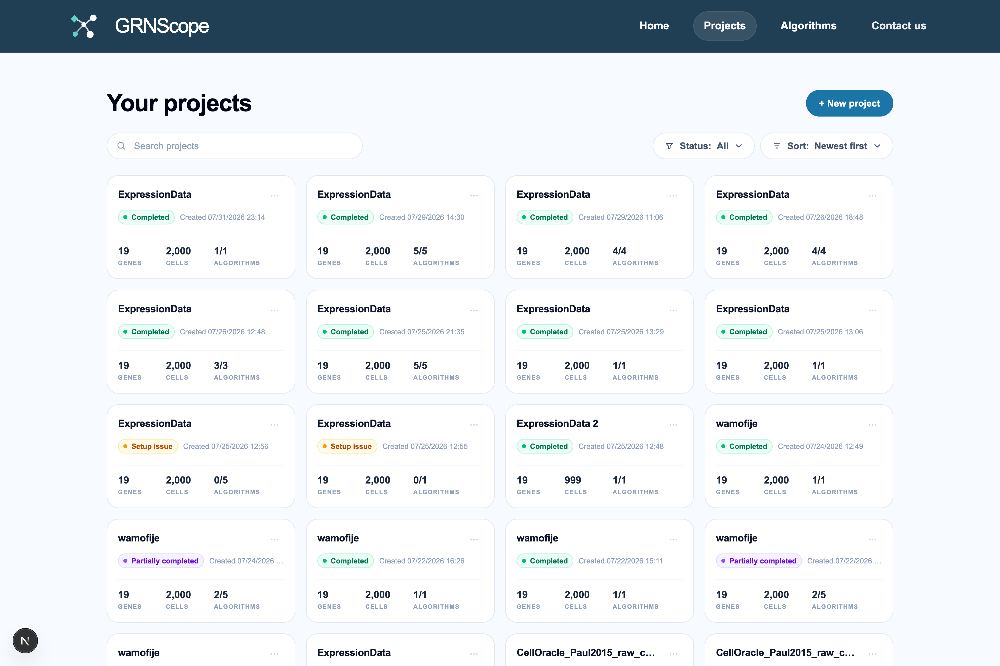
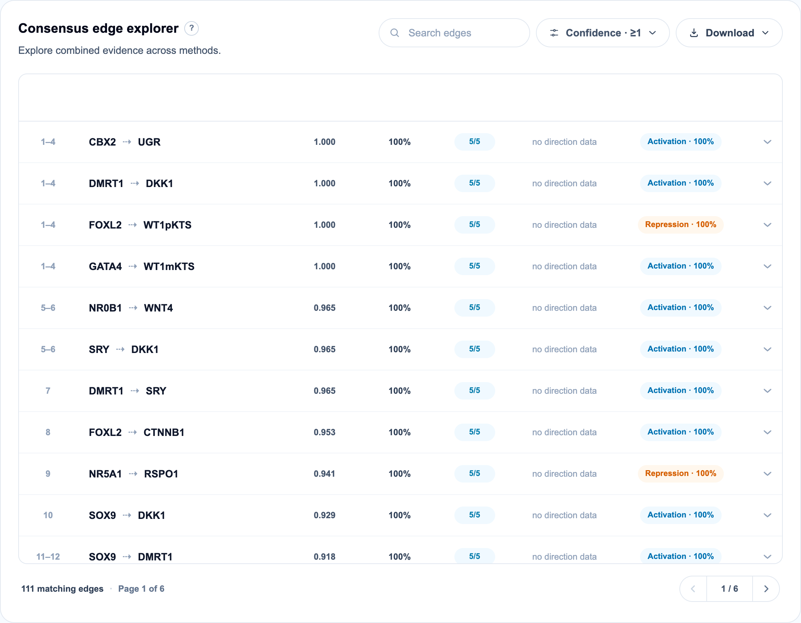
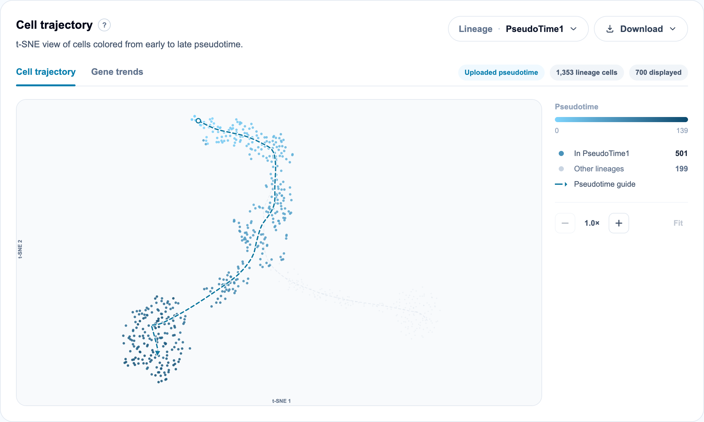

[← Metrics](06-metrics.md) · [Documentation index](README.md) · Next: [Troubleshooting →](08-troubleshooting.md)

# 7. Reading your results

Every number here is defined in [the metrics reference](06-metrics.md). This
chapter is about where to find things and how to interpret the screens.

## 7.1 The project list

Each card shows the analysis name, its status, when it was created, and three
counts: genes, cells, and **algorithms completed out of algorithms selected**
(`5/5`, `1/13`).

Statuses you will see:

| Status | Meaning |
| --- | --- |
| **Completed** | Every selected algorithm finished |
| **Partially completed** | Some finished, some failed or were stopped |
| **Running** | Work in progress |
| **Setup issue** | Failed before any algorithm started — validation or preprocessing |
| **Stopped** | You cancelled it |
| **Failed** | Every algorithm failed |

Filter by status and sort from the toolbar. Cards can be renamed and deleted.
A `1/13` on a completed-looking project is worth investigating: twelve
algorithms did not produce results, and
[troubleshooting](08-troubleshooting.md) explains how to find out why.

## 7.2 Analysis details

Expand this before reading any result. It is the record of what actually
happened, and it answers most "why does this look wrong?" questions:

- **Algorithms executed** — each with its status and total runtime. Failed
  algorithms show an error you can open.
- **Data used for analysis** — the cell count and the **matrix state** that was
  applied (`Already log-normalized` here, meaning no transformation was needed).
- **Genes included** — how many genes survived filtering, out of how many
  uploaded, with the filter that removed them. `19 of 19 genes retained ·
  Detected in ≥10% of cells · 0 genes excluded`.

If the matrix state is wrong, everything downstream is suspect. If the retained
gene count is far smaller than you expected, your filters were too aggressive.

## 7.3 The five views

| View | Requires | Shows |
| --- | --- | --- |
| **Network** | — | The consensus network as an interactive graph |
| **Comparison** | — | Method agreement, per-method stability, the consensus edge table |
| **Trajectory** | Pseudotime | Cells in a 2-D embedding coloured by pseudotime; gene trends |
| **Benchmark** | Ground truth | AUPRC, AUROC, early precision, PR/ROC curves, PathStats |
| **Perturbation** | Completed CellOracle | *In silico* knockdown/overexpression |

Unavailable tabs are greyed out with an explanation of what is missing.

## 7.4 Network

**Reading the graph.** Diamond nodes are known transcription factors for your
species; circles are other genes. Arrows show direction where the methods could
determine it, and edge thickness reflects evidence.

**Layouts.** Five, each answering a different question:

- **Force** — organic clustering; the default and best for a first look
- **Hierarchical** — layered by regulatory depth; good for cascades
- **Hubs** — emphasises high-degree nodes; good for finding master regulators
- **Circular** — nodes on a ring; good for comparing degree at a glance
- **Circos** — a chromosome-aware circular layout using genomic coordinates

**Inspection.** Click a node to see its regulators, targets, degree, and genomic
location. Click an edge to see its full metric breakdown, including each
supporting method's individual evidence and confidence.

**Search genes** highlights and locates a gene in a dense graph.

### Results settings

These filters apply to the graph **and** to the tables simultaneously. The chip
at the top right (`108 matching edges`) updates live.

| Control | What it filters on |
| --- | --- |
| **Algorithms** | Which methods contribute to the consensus. Deselecting a method recomputes everything |
| **Evidence** | Minimum consensus evidence ([§6.8](06-metrics.md#68-consensus--combining-methods)) |
| **Confidence level** | Minimum consensus confidence |
| **Direction confidence** | Minimum direction agreement ([§6.9](06-metrics.md#69-direction-confidence-and-coverage)) |
| **Sign stability** | Minimum sign agreement ([§6.10](06-metrics.md#610-consensus-sign)) |
| **Minimum supporting methods** | Require at least N methods to report the edge |
| **Top-ranked edges** | Display cap — `Showing top 20 of 108 matching edges` |

Note the difference between the **filters** and the **display limit**. Filters
change which edges qualify; the display limit only changes how many of the
qualifying edges are drawn. Both are reported so you always know how much you
are not seeing.

**A reasonable starting point:** Minimum supporting methods ≥ 2, Confidence ≥
70%. Then tighten evidence until the graph is readable.

## 7.5 Comparison

Three stacked panels.

### Repeat-run stability

Per-method reproducibility across bootstrap runs — the median pairwise Spearman
ρ, with the spread shown as a bar and the run count on the right
([§6.12](06-metrics.md#612-repeat-run-stability)).

**Read this panel first.** It tells you which methods to believe at all.
"stopped early" means the ranking settled before the maximum run count, which is
a good sign.

### Method agreement

A pairwise similarity matrix over the top-N edges of each method. The control
pill (`Top 100 · Jaccard · Adjacency`) sets the depth, the metric (Jaccard, RBO,
Spearman) and the comparison mode (topology / direction / sign). Rows and
columns are reordered so similar methods sit together. Click a cell to see the
shared and unique edges for that pair.

High agreement between methods that use the same mathematics (GENIE3 and
GRNBoost2 are both tree-based) is expected and less informative than agreement
between methods that do not.

### Consensus edge explorer

The main results table. Columns:

| Column | Meaning |
| --- | --- |
| **Rank** | Saved consensus position; ties show as a range (`1–4`) |
| **Regulation** | `source → target`. A solid blue arrow means direction is well supported; a dotted grey or amber arrow means direction evidence is limited or split |
| **Evidence** | Consensus evidence, 0–1 |
| **Bootstrap confidence** | Median confidence among supporting methods |
| **Support** | How many selected methods report the edge (`5/5`) |
| **Direction confidence** | Agreement on orientation, or "no direction data" |
| **Regulatory sign** | Activation / Repression with its sign confidence |

Expand any row for the per-method breakdown: each method's evidence,
confidence, raw score, and bootstrap counts.

Search, filter by confidence, sort by any column, and download the full table.
The row count and page navigation sit at the bottom (`111 matching edges · Page
1 of 6`).

> Sorting the table on screen does **not** rewrite the saved Rank column. Rank
> always reflects confidence-then-evidence order, so you can sort by evidence
> and still see where each edge sat in the canonical ordering.

## 7.6 Trajectory

Available with pseudotime, whether you uploaded it or had Slingshot estimate it.

Cells are shown in a **t-SNE embedding coloured from early to late pseudotime**.
When your data has several lineages, a selector switches between them; cells on
other branches are drawn in grey. The header reports how many cells belong to
the selected lineage and how many are displayed — the embedding is capped at 700
cells for responsiveness, sampled across the pseudotime range.

The **Gene trends** tab plots individual genes' smoothed expression along
pseudotime, using a spline fit. Up to 8 genes at once.

The label under the heading (`Uploaded pseudotime` vs an estimated source) tells
you where the ordering came from — worth checking before drawing conclusions
from any pseudotime-based method.

## 7.7 Benchmark

Available when you supplied a ground-truth network.

The header establishes the universe: gene count, possible directed interactions,
reference interactions with their sign split, and the random-precision baseline.
Every metric below is relative to those numbers.

For each method: **AUPRC ratio**, **early-precision ratio**, **AUROC**, and
signed early precision for activation and inhibition. Ratios are shown large
because they are the interpretable form; the raw values sit underneath.

**Read the ratio columns.** 1.0× is chance. The example's best method reaches
1.465×, which is a real but modest margin — normal for this problem.

The curves show the same information as a function of threshold. The PR plot has
a random-precision baseline and can be zoomed to early recall (0–0.25), which is
the region that matters if you plan to follow up only the top predictions. The
ROC plot has a chance diagonal.

**Additional benchmark diagnostics** (collapsed) contains motif counts and
PathStats — the shortest-path analysis of false positives described in
[§6.13](06-metrics.md#pathstats). Open it before concluding a method is
inaccurate; many of its "errors" may be indirect regulation.

## 7.8 Perturbation

Available once CellOracle has completed. This is the only genuinely *predictive*
view: the others describe your data, this one simulates an intervention.

Choose a gene and a target expression value (0 for a knockout, a high value for
overexpression), and CellOracle propagates the change through the inferred
network.

The header cards are described in
[§6.14](06-metrics.md#614-perturbation-metrics). The panels below show:

- **Predicted gene changes** — largest increases and decreases, with a link to
  inspect the full expression distributions
- **Cell fate response** — predicted cell movement in the embedding, overlaid
  with a randomised control, plus a development-impact view showing where the
  perturbation pushes cells along or against their natural trajectory

Perturbation runs are tracked in a **History** list, so you can compare several.
The first run for a project builds a reusable CellOracle model and is
noticeably slower; later runs reuse it.

## 7.9 Downloads

Every panel has a **Download** button, and there are project-level downloads too.

| What | Format | Where |
| --- | --- | --- |
| Network figure | PNG or SVG, with legend | Network view |
| Any table | CSV | The panel's Download menu |
| Per-algorithm ranked edges | CSV | Project downloads |
| Per-bootstrap-run ranked edges | CSV | Inside the algorithm result folder |
| Your original inputs | CSV | Project downloads |
| Analysis metadata | JSON | Project downloads |
| Validation report | CSV | Only when validation found issues |
| Perturbation results | CSV | Perturbation view |

**Download what you need to keep.** Projects are tied to a browser cookie, not
an account ([§1.5](01-overview.md#15-projects-accounts-and-privacy)).

The **analysis metadata** bundle is the one to keep for reproducibility: it
records the algorithms, their resolved parameters, the preprocessing settings,
the matrix state, the gene counts, and the confidence configuration — everything
needed to describe the analysis in a methods section.

## 7.10 Working with per-cluster results

If you uploaded cluster labels, algorithms also run per cluster (clusters with
at least 50 cells). A scope selector then appears, letting you switch between the
global network and each cluster's.

Comparing clusters is where this gets interesting: an edge present globally but
absent in every individual cluster is often driven by differences *between*
cluster means rather than by regulation *within* any cell state.

---

Next: [8. Troubleshooting and FAQ →](08-troubleshooting.md)
